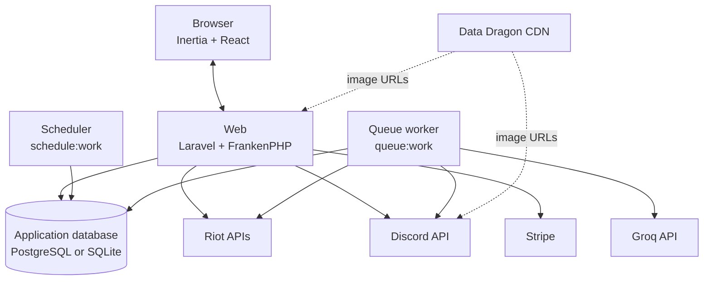

# Architecture

GameSentry is a Laravel application with an Inertia/React interface and a database-backed background processing pipeline. The web application manages accounts, Discord server configuration, watched players, billing and operational views. Scheduled and queued processes monitor Riot match history and deliver Discord notifications outside the HTTP request lifecycle.

## System context

The diagram shows application-level responsibilities. In production, Caddy sits in front of the `web` container and PostgreSQL is reachable only on the internal Compose network.

## Application components

### Web application

Laravel defines the routes, controllers, authentication, authorization and persistence layer. Inertia responses render React/TypeScript pages from `resources/js/pages`; there is no separate public JSON API for the dashboard.

The main web flows are:

- account registration, email verification, passkeys and two-factor authentication through Laravel Fortify;
- Discord bot installation, guild and channel synchronization, and watched-player management;
- Riot account resolution and profile metadata refresh;
- dashboard views for recent notification state and usage;
- Stripe checkout, billing portal access and subscription synchronization through Laravel Cashier;
- admin views and actions for users, Discord servers, watched players, failed notifications and failed queue jobs.

Some external calls are necessarily synchronous. Adding or editing a watched player verifies Discord membership, resolves the Riot ID, records the current latest match and fetches League profile metadata. Match polling and notification delivery are asynchronous.

### Riot integration

The Riot boundary is split by responsibility:

- `RiotApiService` performs Riot Account, Summoner and match API requests for League of Legends and Teamfight Tactics. HTTP 429 responses become `RiotRateLimitException` instances with the optional `Retry-After` value.
- `RiotPollingService` calculates bounded polling intervals and stores per-game rate-limit cooldowns and backoff multipliers in the cache.
- `RiotProfileService` maps regional routing groups to platform candidates when it needs League Summoner API profile data.
- `MatchSummaryService` converts Riot match payloads into game-specific normalized data and Discord embed payloads.
- `DataDragonService` and `RiotAssetService` generate optional profile and League champion image URLs. Missing asset configuration does not prevent an embed from being built.

### Discord integration

`DiscordService` owns Discord OAuth installation URLs and bot-authenticated guild, member, channel and message requests. GameSentry stores the selected guild and channel IDs and mentions the configured Discord user when it posts a notification.

Delivery includes a persisted nonce with Discord's nonce enforcement enabled. If a retry receives Discord's duplicate-nonce response, the job treats the message as already delivered and completes the local notification record.

### Groq integration

`GroqService` sends the normalized match summary to the configured chat-completions endpoint and requests a short French roast. `PlanLimitService` records daily Groq usage before generation, and queue middleware applies an application-wide generation rate limit.

The normalized match payload, Discord embed, generated text and delivery nonce are stored on `MatchNotification`. A retry can therefore reuse completed stages instead of repeating every external request.

### Jobs and scheduler

The scheduler in `routes/console.php` has three responsibilities:

- run `gamesentry:dispatch-watched-player-polls` at the configured interval without overlapping command executions;
- update a cache-backed scheduler heartbeat;
- prune old sent or failed `MatchNotification` records daily.

`DispatchWatchedPlayerPolls` selects due players and dispatches `PollWatchedPlayerJob` instances. Polling jobs only discover match IDs and create notification records. `ProcessMatchNotificationJob` fetches match detail, prepares the message and performs delivery. This boundary keeps a slow generation or Discord call from extending the match-history polling operation.

See [Polling pipeline](polling.md) for the detailed sequence and retry behavior.

## Persistence

The core relationships are:

- a `User` owns `DiscordServer` records;
- a `DiscordServer` owns `WatchedPlayer` and `MatchNotification` records;
- a `WatchedPlayer` stores Riot identity, Discord mention target and polling cursor state;
- a `MatchNotification` stores one watched-player/match delivery attempt and its reusable payloads;
- `DailyUsageCounter` stores per-user Groq usage by date.

The default local environment uses SQLite. WAL mode and a five-second busy timeout support the local web, queue and scheduler processes sharing one file. Production uses PostgreSQL 17.

Queues, failed jobs, cache locks and sessions use the database by default, so the application does not require Redis. In production these records share PostgreSQL with the application data.

## Production runtime

The production Compose project runs:

- `web`: FrankenPHP HTTP process, attached to the internal, egress and external proxy networks;
- `worker`: database queue worker, attached to internal and egress networks;
- `scheduler`: Laravel scheduler, attached only to the internal network;
- `postgres`: PostgreSQL with a health check and named volume, attached only to the internal network.

The three application services use the same immutable GHCR image. Only `web` joins the external `proxy` network; its `gamesentry-web` alias is the upstream used by the separately managed Caddy proxy.

See [Production deployment](deployment.md) for the image and deployment lifecycle.

## Engineering decisions

### Asynchronous external work

Polling, match-detail lookup, AI generation and Discord delivery can be slow or rate limited. Running this work on the database queue keeps dashboard requests independent from those latencies and gives jobs explicit retry behavior.

### Separate discovery from delivery

`PollWatchedPlayerJob` advances the Riot history cursor and creates durable notification work. `ProcessMatchNotificationJob` handles the more expensive and failure-prone enrichment and delivery steps. Each stage can retry with its own timeout and backoff.

### Layered duplicate protection

Queue uniqueness and `WithoutOverlapping` reduce concurrent duplicate execution. Database unique constraints protect the watched-player/match pair and delivery nonce. Discord nonce enforcement addresses the case where Discord accepted a message but the worker failed before recording success.

### Environment-specific databases

SQLite keeps local setup to PHP, Composer and Node. PostgreSQL is used in production for concurrent application and worker access. CI runs the test suite against both engines so PostgreSQL-specific transaction, locking, constraint and JSON behavior is exercised.

### Production-only containers

Local development uses `composer run dev`; Docker is reserved for the production runtime. This keeps onboarding short while retaining explicit production process and network boundaries.

### Immutable application images

GitHub Actions publishes an image tagged with the source commit SHA. Deployment selects that exact reference for `web`, `worker` and `scheduler`, then records it only after verification. Runtime PHP settings and built frontend assets are part of the image rather than mutable server mounts.

## External dependencies

| Dependency      | Used for                                                                              | Failure impact                                                                                                         |
| --------------- | ------------------------------------------------------------------------------------- | ---------------------------------------------------------------------------------------------------------------------- |
| Riot APIs       | Account resolution, profile metadata, match history and match detail                  | Player setup or queued match processing fails and may retry; HTTP 429 also activates a polling cooldown.               |
| Discord API     | Bot installation, guild/channel sync, membership validation and notification delivery | Discord setup or queued delivery fails.                                                                                |
| Groq API        | Generated match commentary                                                            | Notification processing retries unless the user's daily plan limit has been reached.                                   |
| Data Dragon CDN | Riot profile and League champion images                                               | Missing asset configuration omits image URLs; CDN availability affects image rendering rather than summary generation. |
| Stripe          | Pro subscription checkout, portal and webhook state                                   | Billing flows are unavailable; match tracking logic still uses the user's stored plan.                                 |
| Resend          | Transactional email transport                                                         | Email-dependent account flows cannot send messages.                                                                    |
