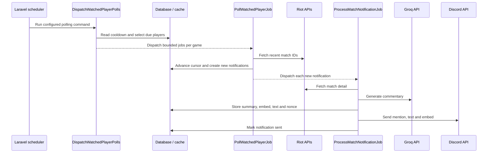

# Polling pipeline

GameSentry polls Riot match history on a schedule and turns each newly discovered match into a durable notification record. Discovery and delivery use separate queue jobs so Riot history checks remain short and notification enrichment can retry independently.

## End-to-end sequence

## 1. Scheduler entry point

`routes/console.php` schedules `gamesentry:dispatch-watched-player-polls`. The interval comes from `gamesentry.scheduler.polling_frequency_minutes`, configured by `GAMESENTRY_POLLING_SCHEDULE_EVERY_MINUTES`. The example environment uses ten minutes.

Laravel's scheduler applies `withoutOverlapping()` to the command. A separate scheduled callback updates the `gamesentry:scheduler:last-run-at` cache key, which the admin dashboard exposes as a scheduler heartbeat.

Local development starts `schedule:work` as part of `composer run dev`. Production runs it in the dedicated `scheduler` container.

## 2. Selecting watched players

`DispatchWatchedPlayerPolls` processes each supported `Game` independently: League of Legends, then Teamfight Tactics.

For each game it:

1. Counts active watched players.
2. Checks the per-game cooldown held by `RiotPollingService`.
3. Calculates a desired polling interval from the active-player count, per-minute dispatch budget and current backoff multiplier, bounded by the configured minimum and maximum.
4. Selects active, due players whose owning user is not paused.
5. Orders them by `next_poll_at` and ID, limits the query to that game's dispatch budget, and dispatches one `PollWatchedPlayerJob` per player.

If a game is in cooldown, the command dispatches no polls for it and moves all currently due `next_poll_at` values to the cooldown end time.

The example environment sets a budget of 15 dispatches per minute for each game, a polling interval range of 900 to 3600 seconds, and a history window of 10 matches. These values are configuration rather than delivery guarantees: scheduler cadence, queue load and external API latency affect actual timing.

## 3. Initial polling behavior

Creating or updating a watched player performs an immediate Riot account lookup and requests the latest match ID. That ID is stored in `last_seen_match_id`; the first scheduled poll is set for five minutes later.

This establishes a cursor at setup time. Existing match history is not announced as new.

If Riot returns no match ID during setup, `last_seen_match_id` remains null. The next successful poll also emits no notifications; it stores the newest returned ID as the baseline. This prevents a player with no initial cursor from generating a batch of historical messages.

## 4. Looking up new matches

`PollWatchedPlayerJob` reloads the watched player and exits when it no longer exists or is inactive. It asks `RiotApiService::recentMatchIds()` for the configured number of recent IDs:

- League uses `/lol/match/v5/matches/by-puuid/{puuid}/ids`.
- Teamfight Tactics uses `/tft/match/v1/matches/by-puuid/{puuid}/ids`.

Riot returns the most recent IDs first. The job reads until it reaches `last_seen_match_id`, then reverses the new portion so notifications are created oldest-first. If the stored cursor has fallen outside the configured history window, every returned ID is treated as new and processed oldest-first.

After a successful lookup, the job:

- reduces the per-game backoff multiplier by one, to a minimum of one;
- persists any new notification records;
- updates `last_seen_match_id` to the newest returned ID;
- records `last_polled_at`;
- sets `next_poll_at` from the calculated interval supplied by the dispatch command.

An empty history leaves the existing cursor unchanged while still recording the successful poll and next poll time.

## 5. Creating notification work

For every new match ID, `PollWatchedPlayerJob` calls `firstOrCreate()` for a `MatchNotification` identified by:

- `watched_player_id`;
- `riot_match_id`.

The database also has a unique constraint on this pair. Only a newly inserted record causes `ProcessMatchNotificationJob` to be dispatched, so repeated history responses do not enqueue a second delivery for the same watched player and match.

New records capture the watched player, Discord server, game, Riot match ID and a `pending` status. Match detail is deliberately deferred to the notification job.

## 6. Preparing the notification

`ProcessMatchNotificationJob` loads the notification with its watched player, Discord server and owner. It exits when the record is missing or already marked `sent`.

The job prepares delivery in resumable stages:

1. If no stored match payload or Discord embed exists, `RiotApiService::match()` fetches match detail.
2. `MatchSummaryService` locates the watched participant and normalizes League or Teamfight Tactics fields.
3. The service builds a Discord embed. Riot profile images and League champion thumbnails use Data Dragon URLs when available.
4. If no roast is stored, `PlanLimitService` consumes one daily Groq call and `GroqService` generates the commentary.
5. The job assigns and persists a random Discord delivery nonce.

The normalized payload, embed, commentary and nonce are stored together before delivery. A delivery retry can reuse them and avoid repeating the Riot and Groq calls.

League summaries include result, KDA, CS, gold, vision and duration. Teamfight Tactics summaries include placement, level, player damage, eliminations, last round, traits and composition.

## 7. Discord delivery

`DiscordService::sendMatchNotification()` posts to the configured Discord channel with:

- a mention of the watched Discord user;
- the generated commentary;
- the structured match embed;
- the persisted nonce with Discord nonce enforcement enabled.

After a successful response, the notification is marked `sent`, its delivery time is recorded, and the returned Discord message ID is stored when available.

If Discord reports that the nonce has already been used, the job treats the earlier request as delivered. This covers a retry after Discord accepted the message but the worker did not persist the success response.

## Duplicate and concurrency protection

The pipeline uses complementary safeguards:

| Layer                  | Protection                                                      |
| ---------------------- | --------------------------------------------------------------- |
| Poll queue job         | `ShouldBeUniqueUntilProcessing` keyed by watched-player ID      |
| Poll execution         | `WithoutOverlapping` keyed by watched-player ID                 |
| Notification row       | Unique `(watched_player_id, riot_match_id)` database constraint |
| Notification queue job | `ShouldBeUniqueUntilProcessing` keyed by notification ID        |
| Notification execution | `WithoutOverlapping` keyed by notification ID                   |
| Discord delivery       | Unique persisted nonce plus Discord `enforce_nonce`             |

The queue uniqueness locks stop applying when processing begins, while `WithoutOverlapping` protects the execution window. Both use the configured cache store, which is database-backed in the example and production environments.

## Riot rate limits and cooldowns

`RiotApiService` converts HTTP 429 responses into `RiotRateLimitException` and preserves a numeric `Retry-After` header when Riot supplies one.

When a history poll is rate limited, `PollWatchedPlayerJob`:

- increments the per-game backoff multiplier up to the configured maximum;
- stores a per-game cooldown using the larger of Riot's retry value or the configured cooldown multiplied by the new multiplier;
- moves that player's `next_poll_at` to the cooldown end;
- rethrows the exception so normal queue retry handling still applies.

When match-detail lookup is rate limited, `ProcessMatchNotificationJob` records the same per-game cooldown and rethrows. The next scheduler run observes that cooldown and delays due polls for that game. Successful history polls gradually reduce the multiplier and clear the active cooldown.

League and Teamfight Tactics use separate cache keys, dispatch budgets and cooldown state.

## Retries and failure states

`PollWatchedPlayerJob` has:

- three attempts;
- a 60-second timeout;
- backoff delays of 5, 30 and 120 seconds.

Its `failed()` hook logs the error and ensures the player receives a future `next_poll_at` value unless a cooldown has already moved it forward.

`ProcessMatchNotificationJob` has:

- ten attempts;
- a 90-second timeout;
- backoff delays of 10, 60 and 180 seconds;
- `RateLimited('groq-notifications')` middleware with a 60-second release delay.

Unhandled Riot, Groq or Discord errors are retried by the queue. After final failure, the notification is marked `failed` with the exception message. Admin users can requeue failed notifications and failed queue jobs from the admin dashboard.

If the user's daily Groq plan limit is exhausted, the notification is marked `failed` immediately and is not thrown back to the queue. A manual retry can be performed after capacity is available.

The production queue worker runs with a 120-second worker timeout and three default tries. The jobs' own timeout and attempt properties define their effective limits. `DB_QUEUE_RETRY_AFTER` is set to 180 seconds in the example environment so reserved jobs are not made available again before the worker timeout.

## Retention

The scheduler runs `model:prune` daily for `MatchNotification`. Sent and failed records older than the configured retention period are deleted; pending notifications are retained. The example environment sets retention to 30 days.
